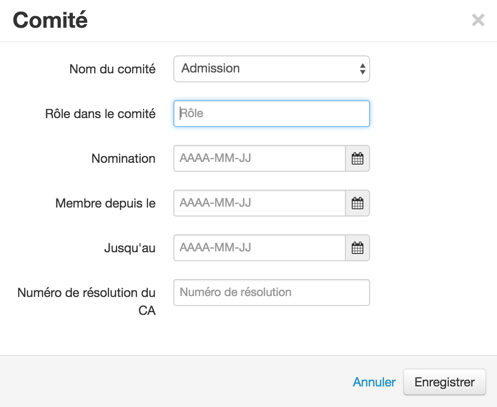

Mise à niveau sur le CSS
========================

Le CSS est la technologie permettant de mettre en forme visuellement le contenu
d'un document HTML. Comme nous utiliserons beaucoup les technologies web durant
le cours, il est bien de connaître un peu de CSS. Si vous n'en avez jamais
fait, c'est le temps de faire une petite mise à niveau. Trouvez un tutoriel de
votre choix sur l'introduction au CSS. Ensuite, faites cet atelier.

Utilisez Google Chrome pour tester l'affichage de votre page.

Objectifs
---------

* Manipuler les propriétés de base du CSS.
* Intégrer le CSS à un dochment HTML.
* Valider un document CSS.

Exercice
--------

Assurez-vous de valider votre document CSS à l'aide du
[Validateur du W3C pour CSS](https://jigsaw.w3.org/css-validator/) et de corriger toutes les erreurs
et tous les avertissements.

Tentez de reproduire le plus fidèlement possible le formulaire suivant :

Les propriétés suivantes pourraient vous être utiles (liste non exhaustive) :
* border
* border-radius
* cursor
* display
* float
* font-family
* font-size
* font-weight
* line-height
* margin
* padding
* text-align
* width
